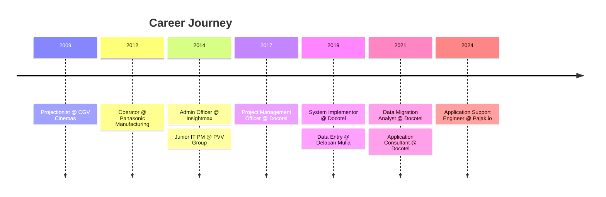

# 👨‍💻 Ardli Firdaus - Professional Profile

<div align="center">


[](https://ardlifirdaus.github.io/profile)
[](mailto:ardli.firdaus@gmail.com)
[](https://github.com/ardlifirdaus)

---

### *"Delivering solutions that make a real difference for users and teams"*

</div>

## 🚀 About This Project

This is my professional online profile website, showcasing my journey as an **Application Support Specialist** with extensive experience in healthcare and ERP systems. Built with modern web technologies, this responsive website presents my career path, technical skills, and professional achievements in an elegant and interactive format.

**🔗 Live Demo:** [ardlifirdaus.github.io/profile](https://ardlifirdaus.github.io/profile)

---

## 👤 About Me

I'm an **Application Support Specialist** with over **6 years of hands-on experience** in:

- 🎯 Helping users and providing technical support
- 💻 Implementing and maintaining software applications
- 🧪 Testing systems and managing SDLC processes
- 🤝 Collaborating with cross-functional teams
- 📊 Working with TestRail for test management
- 🔧 Using GitLab for version control and collaboration

**Current Role:** Application Support Engineer at [PT Fintek Integrasi Digital (Pajak.io)](https://pajak.io/)

---

## 🛠️ Technical Skills

<table>
<tr>
<td width="50%" valign="top">

### 💻 Programming Languages


</td>
<td width="50%" valign="top">

### 🔧 Tools & IDEs


</td>
</tr>
<tr>
<td colspan="2">

### 💼 Core Competencies
```
Application Support  ████████████████████  Expert
Troubleshooting      ████████████████████  Expert
System Testing       ███████████████████░  Advanced
Data Migration       ██████████████████░░  Advanced
Project Management   ████████████████░░░░  Proficient
Technical Writing    ███████████████████░  Advanced
```

</td>
</tr>
</table>

---

## 💼 Professional Experience Timeline



### 🏢 Current Position
**Application Support Engineer** - PT Fintek Integrasi Digital (Pajak.io)
- Troubleshoot and resolve customer product & service issues
- Provide solutions based on customer requirements
- Collaborate with R&D and Management teams
- Weekly reporting and documentation

[View Full Experience Details →](https://ardlifirdaus.github.io/profile#experience)

---

## 🎓 Education

<table>
<tr>
<td width="60%">

**🎓 Bachelor of Computer System**  
University of Indraprasta PGRI (UNINDRA)  
*September 2019 - February 2024*
- Computer Science and Information Technology
- GPA: **3.65/4.00** 🌟

</td>
<td width="40%">

**⚡ Electrical Audio Video**  
SMK N 5 Jakarta  
*August 2006 - May 2009*
- GPA: **8.7/10.0** 🎯

</td>
</tr>
</table>

---

## 🏆 Featured Projects

### 🏦 Enterprise & Government Projects

| Project | Description | Year |
|---------|-------------|------|
| **BNIS → BSI Migration** | Large-scale bank data migration project | 2021 |
| **DITJEN AHU KEMENKUMHAM** | Multiple systems: Kurator, Legalisasi, Wasiat, Beneficial Owner | 2019-2020 |
| **Smartfren SASIS** | Aftersales Service Integrated System | - |
| **Hisense REJEKI PureShot** | Mobile application project | - |

[🔗 View All Projects](https://ardlifirdaus.github.io/profile#projects)

---

## 📜 Certifications & Achievements

<details>
<summary><b>🏅 Click to view all certifications</b></summary>

- ✅ **Digital Talent Scholarship - Front End Web** (June-July 2020)
- ✅ **Digital Talent Scholarship - Android Development** (Aug-Sep 2019)
- 🏀 **1st Place - Docotel 3 on 3 Basketball Competition** (August 2019)
- ✅ **Intermediate Web Design for SME** (Jan-Feb 2014)

</details>

---

## 🌐 Website Features

### ✨ What's Inside

- 📱 **Fully Responsive Design** - Perfect on all devices (mobile, tablet, desktop)
- 🎨 **Modern UI/UX** - Clean and professional interface
- ⚡ **Fast Loading** - Optimized performance
- 📊 **Interactive Sections** - Smooth scrolling navigation
- 🎯 **Comprehensive Info** - Complete career history and skills showcase

### 🛠️ Built With


### 📂 Project Structure

```
profile/
├── index.html              # Main HTML file
├── assets/
│   ├── css/               # Stylesheets
│   ├── js/                # JavaScript files
│   ├── img/               # Images and photos
│   └── vendor/            # Third-party libraries
└── README.md              # This file
```

---

## 🚀 Getting Started

### View Online
Simply visit: **[ardlifirdaus.github.io/profile](https://ardlifirdaus.github.io/profile)**

### Run Locally

```bash
# Clone the repository
git clone https://github.com/ardlifirdaus/profile.git

# Navigate to project directory
cd profile

# Open in browser
# Option 1: Direct open
open index.html

# Option 2: Using Python
python -m http.server 8000

# Option 3: Using Node.js
npx http-server

# Then visit: http://localhost:8000
```

---

## 📊 GitHub Stats

<div align="center">


</div>

---

## 📬 Get In Touch

<div align="center">

I'm always open to discussing new projects, opportunities, or just having a tech chat!

📧 **Email:** [ardli.firdaus@gmail.com](mailto:ardli.firdaus@gmail.com)  
🌐 **Portfolio:** [ardlifirdaus.github.io/profile](https://ardlifirdaus.github.io/profile)  
💼 **LinkedIn:** Connect with me on LinkedIn  
📍 **Location:** Kranji, Bekasi Barat, Indonesia

</div>

---

## 🤝 Contributing

While this is a personal profile website, suggestions and feedback are always welcome!

1. Fork the project
2. Create your feature branch (`git checkout -b feature/AmazingFeature`)
3. Commit your changes (`git commit -m 'Add some AmazingFeature'`)
4. Push to the branch (`git push origin feature/AmazingFeature`)
5. Open a Pull Request

---

## 📝 License

This project is open source and available under the MIT License.

---

## 🙏 Acknowledgments

- **Original Template:** Custom design inspired by [Affandy Murad](https://affandymurad.github.io/about/)
- **Base Theme:** [Start Bootstrap Resume Template](https://startbootstrap.com/themes/resume/)
- **Icons:** Font Awesome
- **Hosting:** GitHub Pages

---

<div align="center">

### 💖 If you find this profile helpful, please give it a ⭐

**Made with ❤️ by Ardli Firdaus**

*Last Updated: January 2026*

[](https://forthebadge.com)
[](https://forthebadge.com)

</div>
